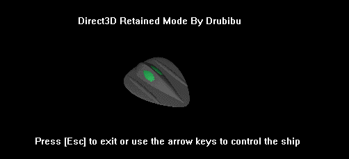



## Direct3D Basics

### Description

A really easy and detailed program to introduce you to Direct3D, in the sample you control a 3D ship. The code is heavily documented and simplified, if you're new to direct3D it's a real reccomendation.
 
### More Info
 
You need DirectX 7 or higher installed on your machine for this code to work. You can download DirectX at www.microsoft.com

             |
---                |---
**Submitted On**   |2000-08-22 20:51:00
**By**             |[Drubibu](https://github.com/Planet-Source-Code/PSCIndex/blob/master/ByAuthor/drubibu.md)
**Level**          |Advanced
**User Rating**    |4.8 (77 globes from 16 users)
**Compatibility**  |VB 5\.0, VB 6\.0
**Category**       |[DirectX](https://github.com/Planet-Source-Code/PSCIndex/blob/master/ByCategory/directx__1-44.md)
**World**          |[Visual Basic](https://github.com/Planet-Source-Code/PSCIndex/blob/master/ByWorld/visual-basic.md)
**Archive File**   |[CODE\_UPLOAD92178222000\.zip](https://github.com/Planet-Source-Code/drubibu-direct3d-basics__1-10913/archive/master.zip)

